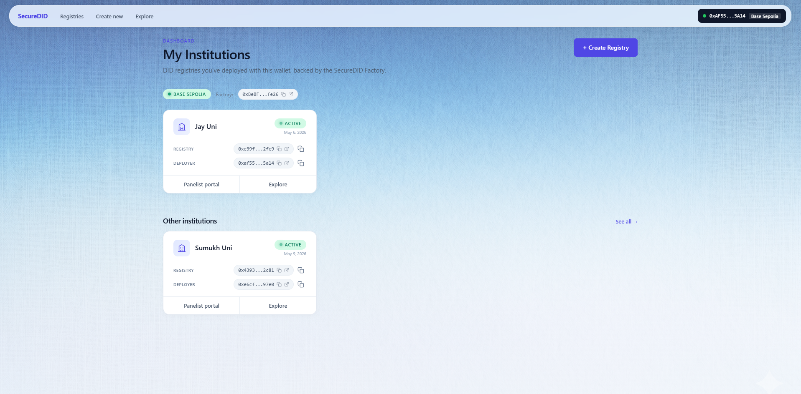
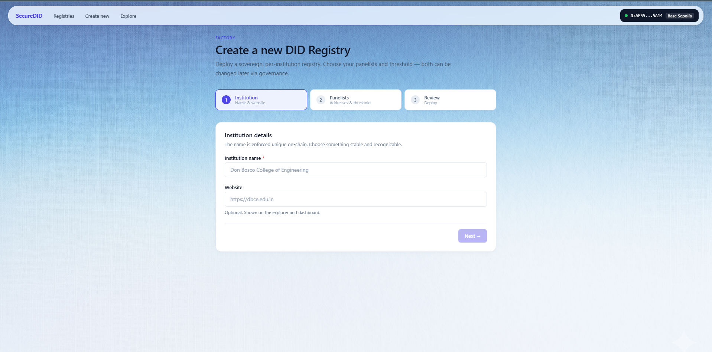
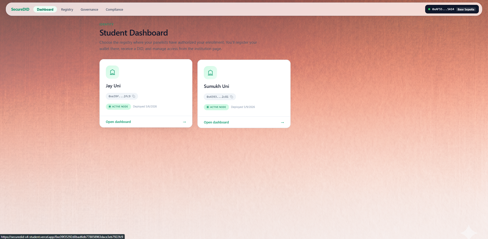
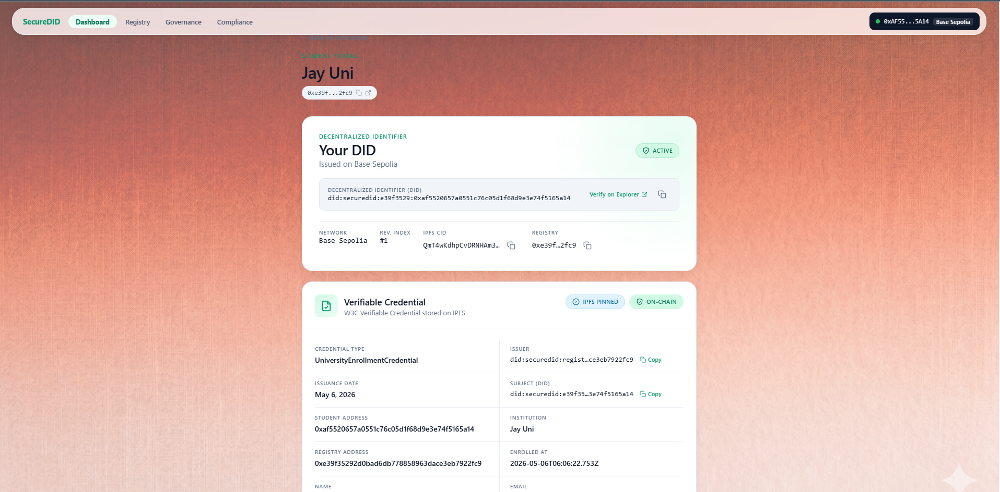
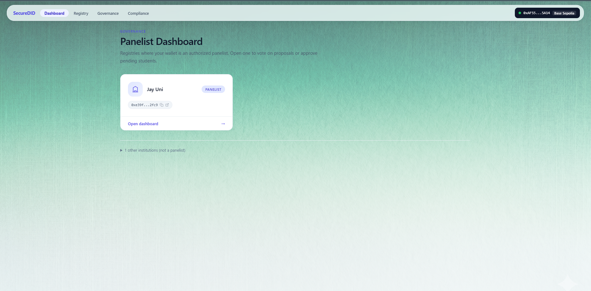
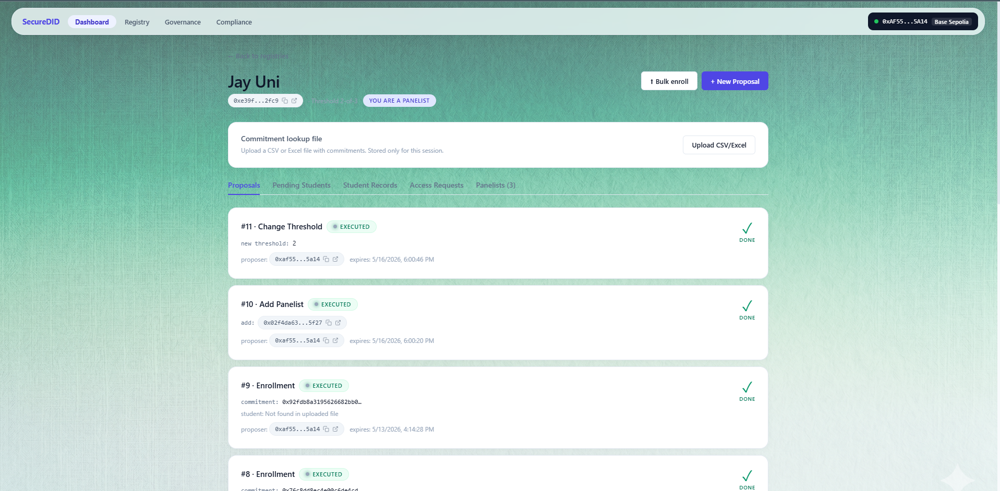
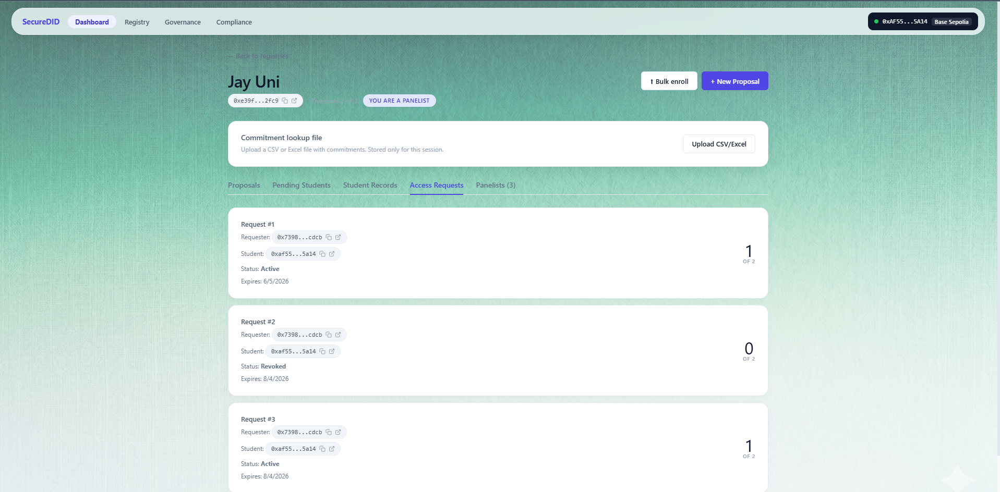
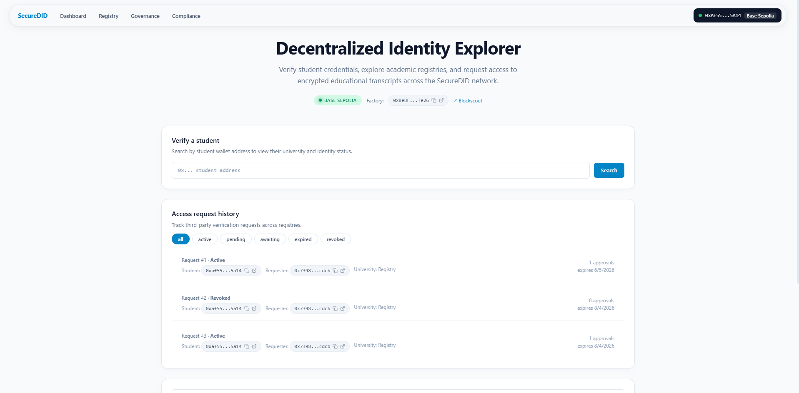
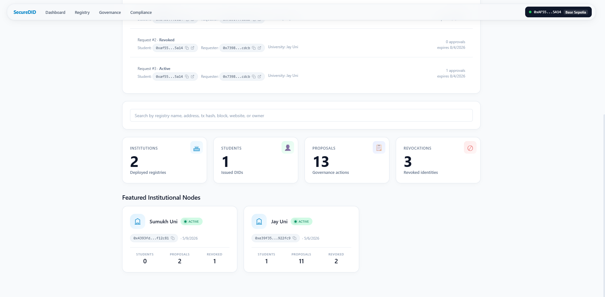

# SecureDID v4

> SecureDID v4 is a decentralized identity verification ecosystem for educational institutions, students, and verifiers using DIDs, encrypted verifiable credentials, wallet authentication, governance approvals, and controlled access management on Base Sepolia.


---

# Live Production Demos

| App | URL |
|---|---|
| Factory | https://securedid-v4-factory.vercel.app/ |
| Panelist | https://securedid-v4-panelist.vercel.app/ |
| Student | https://securedid-v4-student.vercel.app/ |
| University | https://securedid-v4-university.vercel.app/ |
| College | https://securedid-v4-college.vercel.app/ |
| Explorer | https://securedid-v4-explorer.vercel.app/ |

---

# Overview

SecureDID v4 is a decentralized student identity and verification platform built on Base Sepolia using Solidity smart contracts, Next.js applications, RainbowKit wallet authentication, and encrypted Verifiable Credentials stored through IPFS/Pinata.

The platform enables:

- Educational institutions to issue decentralized student identities
- Panelists to approve or revoke identities through governance
- Students to manage encrypted credentials
- Universities and colleges to verify identities securely
- Third-party access management with approval flows
- DID-based verification using blockchain-backed trust

---

# Core Features

- Decentralized Identity (DID) issuance
- Multi-panelist governance approvals
- Verifiable Credential (VC) encryption
- IPFS/Pinata credential storage
- Wallet-based authentication using RainbowKit
- TTL-based access grants
- Revocation handling
- Verification access workflows
- Replay attack prevention
- Identity fraud simulations
- Governance attack simulations
- Multi-app monorepo architecture

---

# Architecture

```text
Student Wallet
    ↓
DID Registry
    ↓
Panelist Governance
    ↓
VC Issuance
    ↓
Encrypted IPFS Storage
    ↓
Access Manager
    ↓
University Verification
```

---

# Monorepo Structure

```bash
apps/
├── factory
├── panelist
├── student
├── university
├── college
├── explorer
├── attack-demo

packages/
└── shared

blockchain/
└── contracts
```

---

# Applications

## Factory App

Creates and manages institution DID registries.

Features:
- Institution creation
- Registry deployment
- Threshold setup
- Panelist initialization

Deployment:
https://securedid-v4-factory.vercel.app/

---

## Panelist App

Panelist governance and verification dashboard.

Features:
- Student approval
- DID governance
- Revocation management
- VC uploads
- Access approvals

Deployment:
https://securedid-v4-panelist.vercel.app/

---

## Student App

Student DID registration and credential management.

Features:
- Student registration
- VC viewing
- Credential decryption
- Access grants

Deployment:
https://securedid-v4-student.vercel.app/

---

## University App

University verification portal.

Features:
- DID verification
- Access validation
- Credential verification
- Registry status checks

Deployment:
https://securedid-v4-university.vercel.app/

---

## College App

College access verification portal with SIWE support.

Features:
- Wallet authentication
- Access validation
- DID verification
- SIWE integration

Deployment:
https://securedid-v4-college.vercel.app/

---

## Explorer App

Registry and student explorer.

Features:
- Search registries
- Search students
- Access requests
- Credential verification lookup

Deployment:
https://securedid-v4-explorer.vercel.app/

---

## Attack Demo

Security simulation environment.

Features:
- Replay attack simulation
- Identity spoofing tests
- Revocation handling
- Governance attack prevention

---

# Smart Contracts

## DIDFactory.sol

Responsible for:
- Deploying institution registries
- Tracking institution metadata
- Registry management

Known deployed factory address:

```txt
0x0d22eF5A76d7a324c4177B2751570F54e4EC0B86
```

---

## DIDRegistryV6.sol

Handles:
- Student registration
- DID issuance
- Panelist governance
- Threshold approvals
- Access grants
- Revocations
- Identity state management

---

## VerificationAccessManager.sol

Handles:
- Third-party verification requests
- Student approval flows
- University access management
- Credential access permissions

---

# Tech Stack

## Frontend
- Next.js 14.2.33
- React 18
- TypeScript
- Tailwind CSS

## Blockchain
- Solidity 0.8.20
- Hardhat
- ethers v6
- viem
- wagmi
- RainbowKit

## Infrastructure
- Vercel
- IPFS
- Pinata
- Base Sepolia

---

# Base Sepolia Configuration

```txt
Network: Base Sepolia
Chain ID: 84532
RPC: https://sepolia.base.org
```

---

# Demo Flow

## 1. Factory
- Connect wallet
- Create institution registry
- Configure panelists
- Set approval threshold

## 2. Student
- Register student DID
- Submit enrollment metadata
- Encrypt/store VC on IPFS

## 3. Panelist
- Review pending students
- Approve DID issuance
- Revoke compromised credentials

## 4. University
- Verify DID status
- Validate VC access permissions

## 5. College
- Authenticate wallet
- Validate student access

## 6. Explorer
- Search registries/students
- Request VC verification access

## 7. Attack Demo
- Simulate replay attacks
- Simulate identity spoofing
- Simulate revoked credential access
- Simulate governance attacks

---

# Screenshots

## Factory Dashboard





## Student Dashboard





## Panelist Dashboard







---

## Explorer





---

# Environment Variables

Create a `.env.local` file.

```env
NEXT_PUBLIC_FACTORY_ADDRESS=
NEXT_PUBLIC_ACCESS_MANAGER_ADDRESS=
NEXT_PUBLIC_VERIFICATION_ACCESS_MANAGER_ADDRESS=

NEXT_PUBLIC_IPFS_GATEWAY=
NEXT_PUBLIC_PINATA_JWT=

BASE_RPC_URL=https://sepolia.base.org

NEXT_PUBLIC_PLATFORM_ADDRESS=

NEXT_PUBLIC_FACTORY_URL=
NEXT_PUBLIC_PANELIST_URL=
NEXT_PUBLIC_STUDENT_URL=
NEXT_PUBLIC_UNIVERSITY_URL=
NEXT_PUBLIC_COLLEGE_URL=
NEXT_PUBLIC_EXPLORER_URL=
```

⚠️ Never commit:
- private keys
- wallet seed phrases
- JWT secrets
- `.env.local`

---

# Local Development

## Install Dependencies

```bash
npm install
```

---

## Run Applications

### Factory
```bash
npm run dev:factory
```

### Panelist
```bash
npm run dev:panelist
```

### Student
```bash
npm run dev:student
```

### University
```bash
npm run dev:university
```

### College
```bash
npm run dev:college
```

### Explorer
```bash
npm run dev:explorer
```

---

# Local Ports

| App | Port |
|---|---|
| Factory | 3000 |
| Panelist | 3001 |
| Student | 3002 |
| University | 3003 |
| College | 3004 |
| Explorer | 3005 |

---

# Build Commands

```bash
npm run build
npm run build:factory
npm run build:panelist
npm run build:student
npm run build:university
npm run build:college
npm run build:explorer
```

---

# Deployment

All frontend applications are deployed on Vercel.

Deployment strategy:
- Independent app deployments
- Shared package architecture
- Base Sepolia smart contract integrations

---

# Security Model

SecureDID v4 uses:
- Wallet-based authentication
- DID verification
- Governance thresholds
- Access approval workflows
- Credential encryption
- Revocation management
- TTL-based access control

---

# Important Notes

- This repository currently uses the `master` branch as default.
- Ensure Vercel deployment configuration matches the active branch.
- Avoid exposing secrets in commits or screenshots.

---

# Roadmap

- Mainnet deployment
- Mobile wallet support
- zkProof integrations
- Cross-chain DID support
- DAO governance expansion
- Advanced VC standards support

---

# Contributing

Please read:
- CONTRIBUTING.md
- SECURITY.md
- CODE_OF_CONDUCT.md

---

# License

MIT License

---

# Author

Jay Rane  
Founder — Silent Minds

GitHub:
https://github.com/jayranedev
